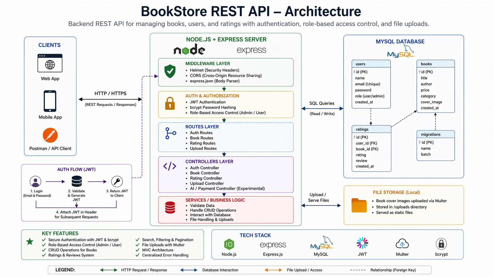

# 📚 BookStore REST API


**A backend REST API for managing books, users, and ratings with secure authentication, role-based access control, and structured query handling.**  
Built using Node.js, Express, and MySQL, this project demonstrates core backend fundamentals including CRUD operations, file uploads, search/filtering, and API security.

🔗 **Project Links**  

- 🌐 **[Live API](https://bookstore-api-czay.onrender.com/)** *(test using Postman or browser)*  
- 💻 **[GitHub](https://github.com/TirthWillLearn/Bookstore-API)**

---

## 📑 Table of Contents
- [Overview](#overview)
- [Key Highlights](#key-highlights)
- [Features](#features)
- [Architecture](#architecture)
- [Tech Stack](#tech-stack)
- [Project Structure](#project-structure)
- [Getting Started](#getting-started)
- [API Overview](#api-overview)
- [Detailed API Reference](#detailed-api-reference)
- [Security Notes](#security-notes)
- [Limitations & Future Improvements](#limitations--future-improvements)
- [Deployment](#deployment)
- [Author](#author)

---

## Overview

This project implements a backend system for managing books, user accounts, and ratings using a relational database (MySQL).  

It focuses on backend fundamentals such as authentication, role-based access control, relational data modeling, and efficient querying using filtering and pagination.

---

## Key Highlights

- JWT-based authentication with bcrypt password hashing  
- Role-based access control (admin vs user)  
- Structured relational database design using MySQL  
- Search, filtering, and pagination for scalable queries  
- File upload handling using Multer  
- Middleware-based validation and centralized error handling  

---

## Features

- **Authentication & Authorization**  
  - Secure login/signup using JWT and bcrypt  
  - Role-based access control for users and admins  

- **Books Management**  
  - CRUD operations for books  
  - Search, filtering, and pagination  

- **Ratings System**  
  - Users can add ratings & reviews  

- **File Uploads**  
  - Upload book cover images using Multer  

- **Architecture**  
  - MVC pattern  
  - Middleware validation and centralized error handling  

---

## Architecture

High-level backend architecture showing how client requests are processed through different layers of the system.

The application follows a layered MVC structure:

- **Clients (Web / Mobile / API tools)** send HTTP requests to the backend
- **Express server** handles routing, middleware, and request processing
- **Middleware layer** manages security (Helmet, CORS), request parsing, and authentication
- **Controllers** handle business logic and interact with the database
- **MySQL database** stores persistent data (users, books, ratings)
- **File storage** handles uploaded book cover images via Multer

The diagram also highlights:
- JWT-based authentication flow
- Role-based access control (admin vs user)
- Clear separation of concerns between layers

This structure keeps the application modular, maintainable, and easy to extend.



## Tech Stack

- Backend: Node.js, Express.js  
- Database: MySQL  
- Authentication: JWT, bcrypt  
- Security: Helmet, CORS  
- File Uploads: Multer  
- Architecture: MVC  

---

## Project Structure

```
Bookstore-api-main/
server.js
config/
controllers/
middleware/
routes/
experimental_features/
```

---

## Getting Started

```bash
git clone https://github.com/TirthWillLearn/bookstore-api.git
cd bookstore-api
npm install
npm start
```

---

##  API Overview

### Auth Routes
- POST `/api/auth/register`
- POST `/api/auth/login`

### Book Routes
- GET `/api/book`
- GET `/api/book/:id`
- POST `/api/book/add` (Admin only)
- POST `/api/book/upload`

### Rating Routes
- POST `/api/rating/:bookId`
- GET `/api/rating/book/:bookId`

---

## Detailed API Reference

### Register User — POST `/api/auth/register`

**Validations**
- name → required  
- email → valid format  
- password → minimum 8 chars  

**Request**
```json
{
  "name": "Tirth Patel",
  "email": "example@example.com",
  "password": "123456"
}
```

**Response**
```json
{
  "message": "User registered successfully",
  "user": {
    "id": 12,
    "name": "Tirth Patel",
    "email": "example@example.com",
    "role": "user"
  }
}
```

---

### Login User

```json
{
  "email": "example@example.com",
  "password": "password123"
}
```

---

### Add Book

```json
{
  "title": "Clean Code",
  "author": "Robert C. Martin",
  "price": 499,
  "category": "Programming"
}
```

---

### List/Search

```json
{
  "success": true,
  "data": []
}
```

---

### Add Rating

```json
{
  "rating": 5,
  "review": "Excellent!"
}
```

---

## Security Notes

- JWT authentication  
- bcrypt password hashing  
- Role-based authorization  
- Environment variable protection

---

## Limitations & Future Improvements

- Currently uses a single-instance backend (no horizontal scaling)
- File uploads are stored locally; can be improved using cloud storage (e.g., S3)
- Search functionality can be enhanced with full-text search or indexing
- Pagination can be optimized further for large datasets
- Lacks caching layer (e.g., Redis) for frequently accessed data

---

## Deployment

- Backend: Render / Railway  
- Database: MySQL (Railway / AWS RDS / PlanetScale)  

---

## Author

**Tirth Patel** — Backend Developer

[](https://github.com/TirthWillLearn)
[](https://www.linkedin.com/in/tirth-k-patel/)
[](https://tirthdev.in)
